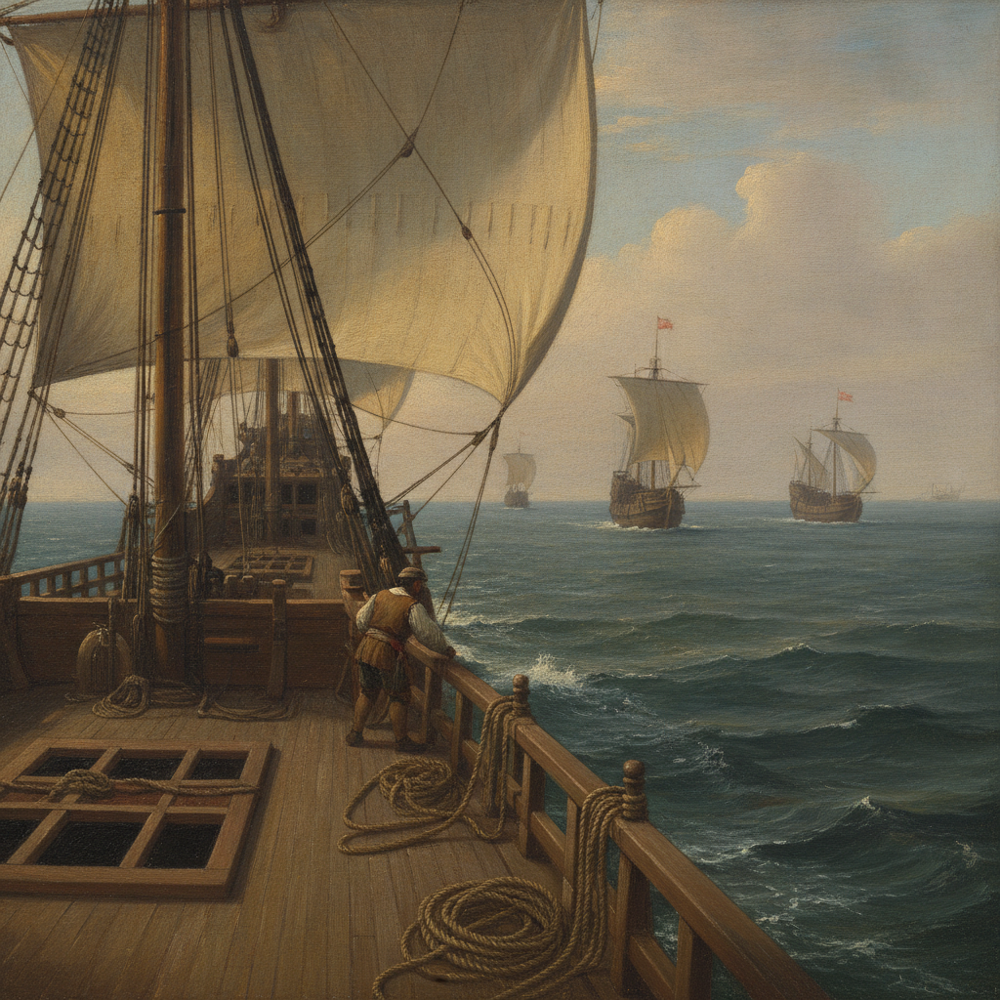
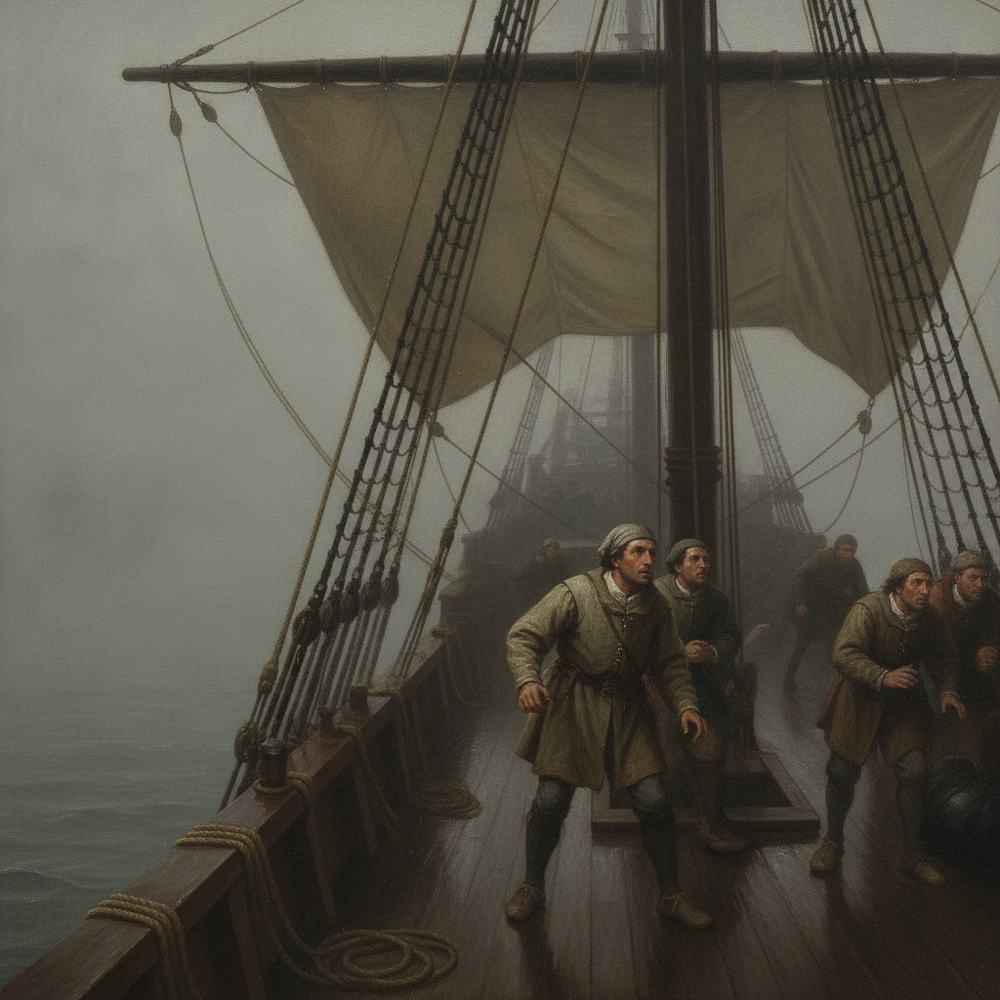
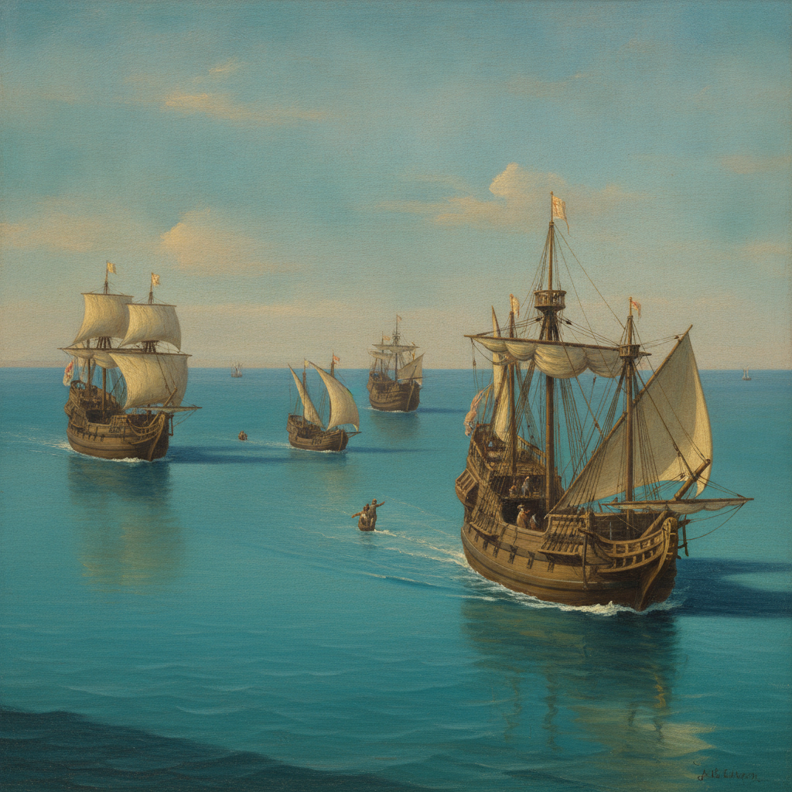
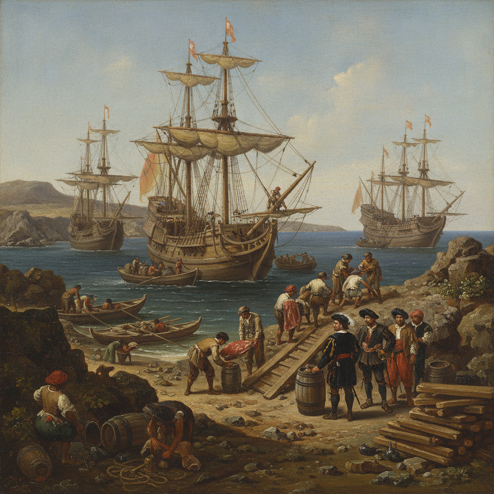
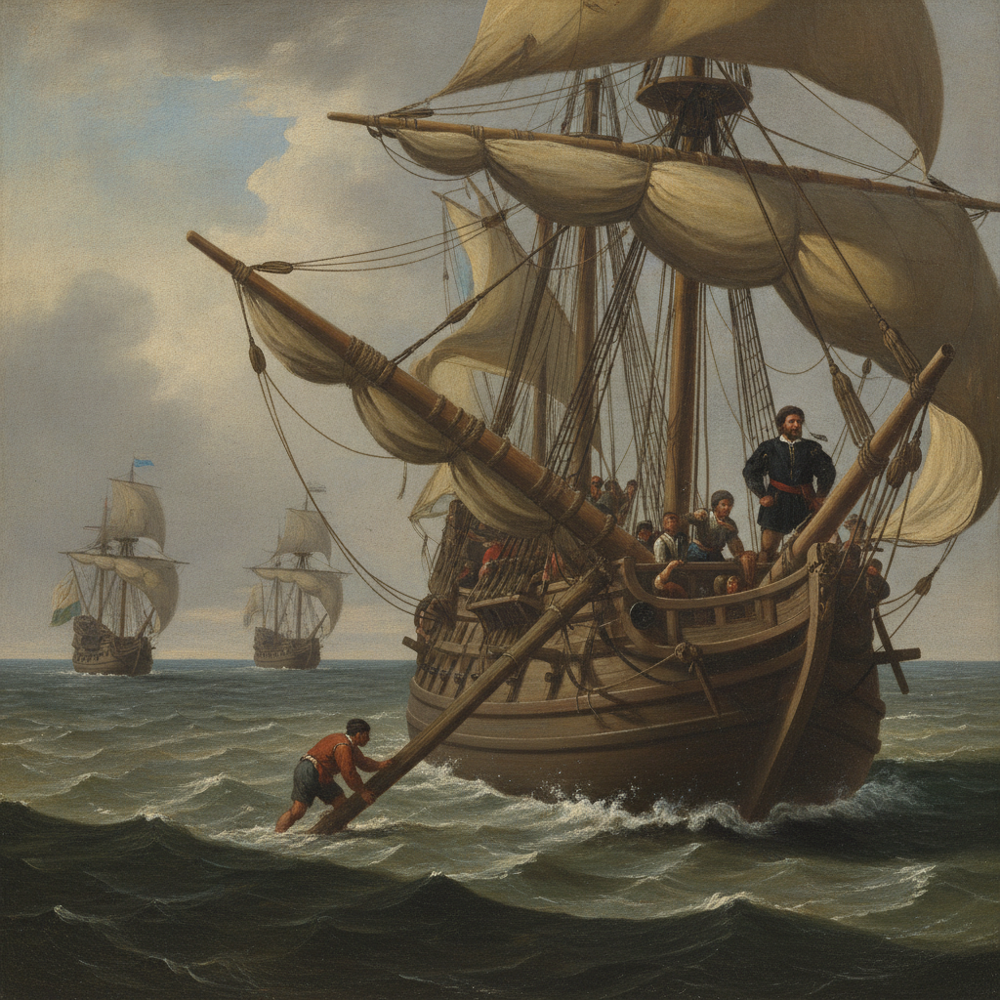
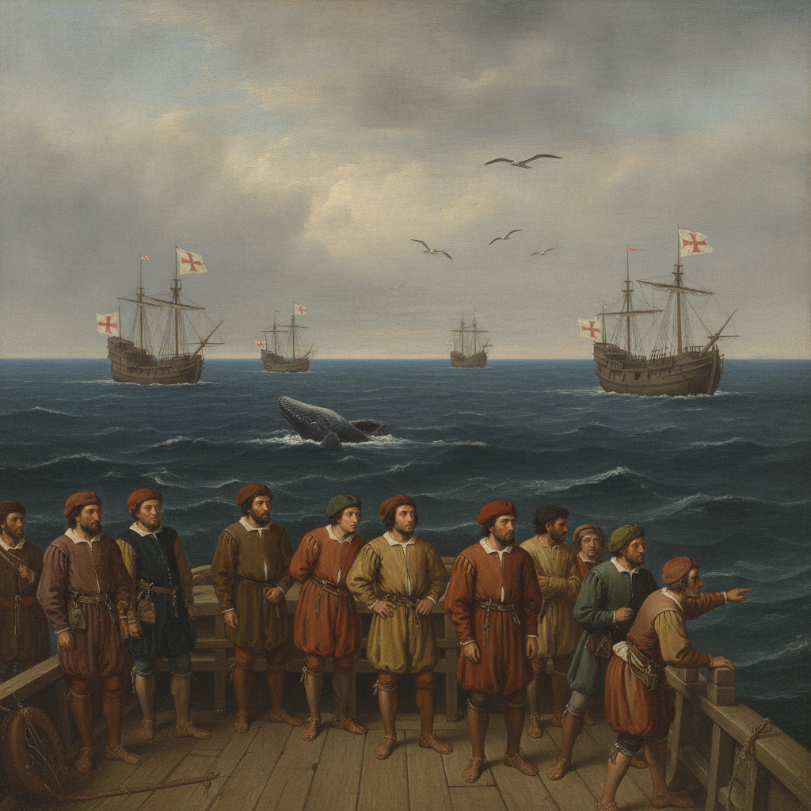
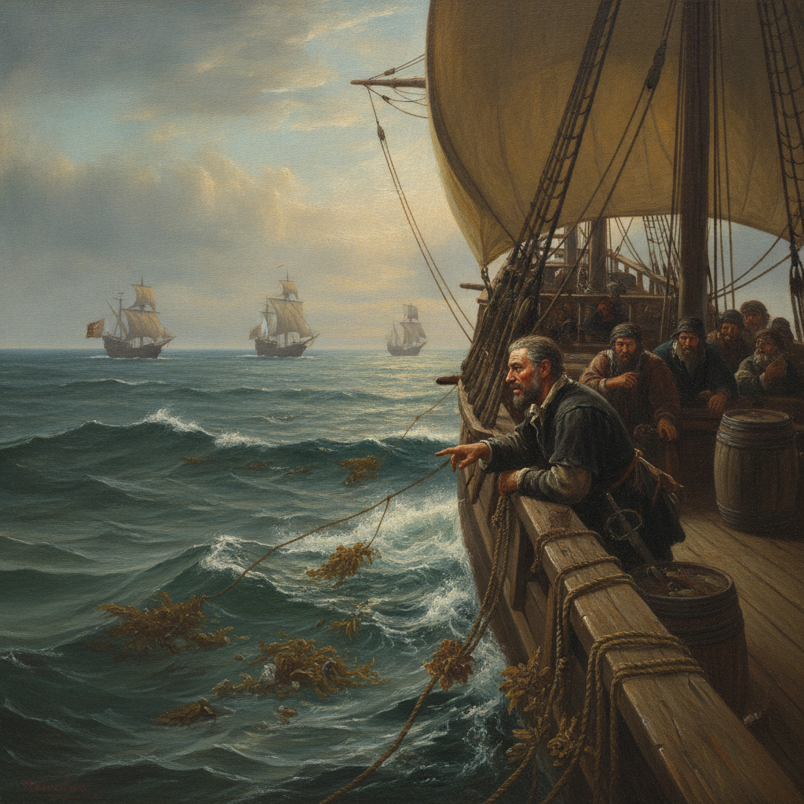
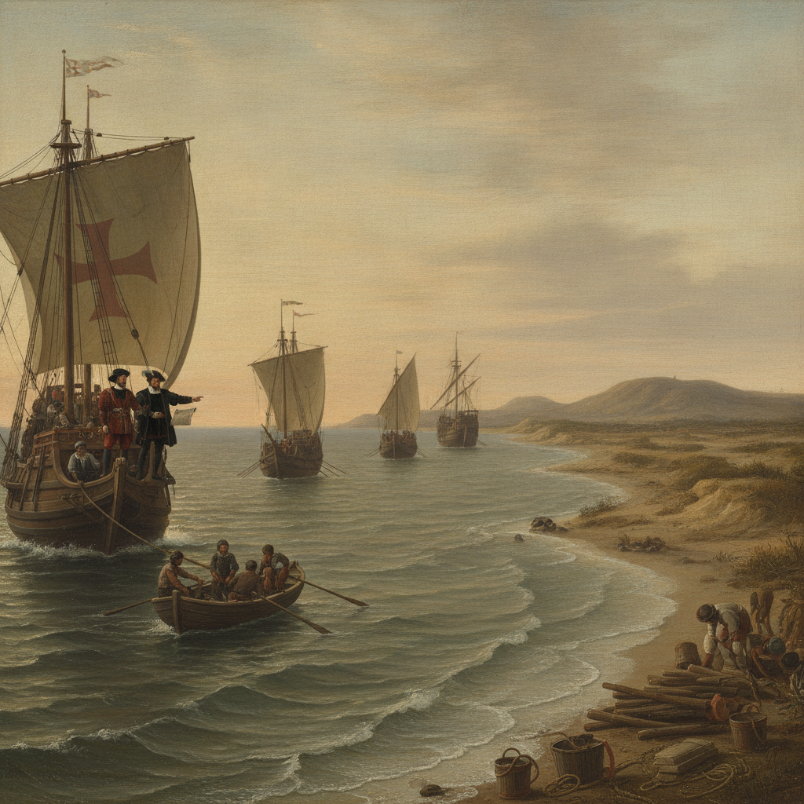

# CH01-EP02 — Atlantic: Into the Unknown

## Approved Storyboard Assembly

**Status:** LOCKED / CANONICAL — `CH01-EP02-LOCK-v1` — 25 August 2026  
**Source spine:** Anonymous first-voyage *Roteiro*, Ravenstein 1898 edition  
**Visual benchmark:** `MASTER_STYLE_02` (Cinematic European Historical Painting)  
**Image policy:** All panels below are approved canonical rasters; source fact, historical context, reconstruction, and cinematic interpretation are distinguished in the scene files.

---

### Panel 01 — Open Water After Lisbon

* **Scene:** [CH01-EP02-S01](../scenes/CH01-EP02-S01.md)
* **Date & Location:** 10–15 July 1497, Open Atlantic west of Iberia
* **Beat:** The Iberian coastline fades on the horizon; the four vessels settle into practical ocean sailing formation.
* **Transition:** Slow deck drift from the receding shoreline into the rolling ocean swell.

---

### Panel 02 — Fog and Separation

* **Scene:** [CH01-EP02-S02](../scenes/CH01-EP02-S02.md)
* **Date & Location:** 16–17 July 1497, Atlantic near Rio do Ouro
* **Beat:** Dense Atlantic sea-fog swallows the fleet; crew on *São Rafael* peer into the blank grey mist, separated from their companions.
* **Transition:** Dissolve from rolling waves into muffled grey mist and dripping canvas.

---

### Panel 03 — Sal and Reunion

* **Scene:** [CH01-EP02-S03](../scenes/CH01-EP02-S03.md)
* **Date & Location:** 22–26 July 1497, Cape Verde / Ilha do Sal
* **Beat:** Sails emerge through heat haze off Sal; the separated ships signal and rejoin formation with quiet relief.
* **Transition:** Cut through shimmering heat distortion to the low silhouettes of the four ships converging.

---

### Panel 04 — São Thiago Stores and Repairs

* **Scene:** [CH01-EP02-S04](../scenes/CH01-EP02-S04.md)
* **Date & Location:** 27 July 1497, Bay of Santa Maria, São Thiago
* **Beat:** Intensive logistical work: loading casks of water, meat, and wood, while shipwrights refit a damaged yard on *São Gabriel*.
* **Transition:** Hard cut to bustling shore labor, clattering casks, and working tools under harsh island light.

---

### Panel 05 — The Broken Main Yard

* **Scene:** [CH01-EP02-S05](../scenes/CH01-EP02-S05.md)
* **Date & Location:** 18 August 1497, Southern Atlantic (~200 leagues offshore)
* **Beat:** Crisis in deep water: *São Gabriel*'s main yard snaps under strain; the fleet lies to while carpenters and sailors secure the spar.
* **Transition:** Sudden snap sound match into rolling swell, reduced canvas, and sailors straining against heavy timber.

---

### Panel 06 — Birds and Whale in the Open Sea

* **Scene:** [CH01-EP02-S06](../scenes/CH01-EP02-S06.md)
* **Date & Location:** 22 August 1497, Open South Atlantic
* **Beat:** Vast ocean solitude: a whale breaches peacefully at distance; southward birds cross the sky, reinforcing the living scale of the sea.
* **Transition:** Wide expansive pull back; swell breathing rhythmically under an immense sky.

---

### Panel 07 — Signs of Land

* **Scene:** [CH01-EP02-S07](../scenes/CH01-EP02-S07.md)
* **Date & Location:** Late October – 1 November 1497, Approaching Southern Africa
* **Beat:** Floating gulf-weed and marine drift indicate an approaching coast after nearly three months out of sight of land.
* **Transition:** Macro focus on floating kelp and ocean surface moving past the hull into an expectant crew look.

---

### Panel 08 — Landfall Before St Helena

* **Scene:** [CH01-EP02-S08](../scenes/CH01-EP02-S08.md)
* **Date & Location:** 4–8 November 1497, Bay of St Helena (Southwest Africa)
* **Beat:** Landfall at dawn: a sounding boat scouts ahead as the four weary ships enter the broad bay to prepare for the Cape passage.
* **Transition:** Low morning light catches the sandy African shore; anchor gear prepares to drop.

---

## Storyboard Continuity Summary

| Metric | Continuity Status |
|---|---|
| **Character State (`VASCO_01`)** | Fresh departure woolens (S01–S04) → progressive sun-darkening and salt wear (S05–S08). |
| **Fleet Count** | Consistently four vessels (`SHIP_SG01`, `SHIP_SR01`, `SHIP_B01`, `SHIP_ST01`), plus sounding skiff only when historically noted (S08). |
| **Style Adherence** | Unified under `MASTER_STYLE_02` European oil painting aesthetic. |
| **Integrity** | All SHA-256 hashes locked in [`production/locks/CH01-EP02-lock-v1.md`](../production/locks/CH01-EP02-lock-v1.md). |
