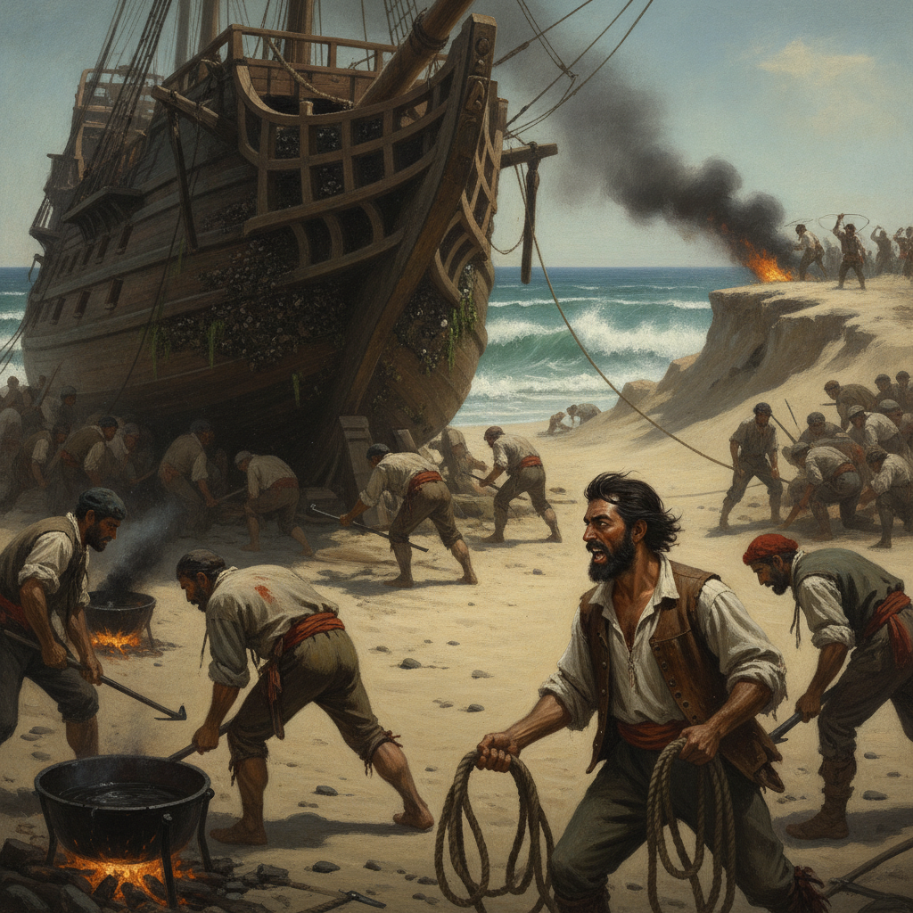
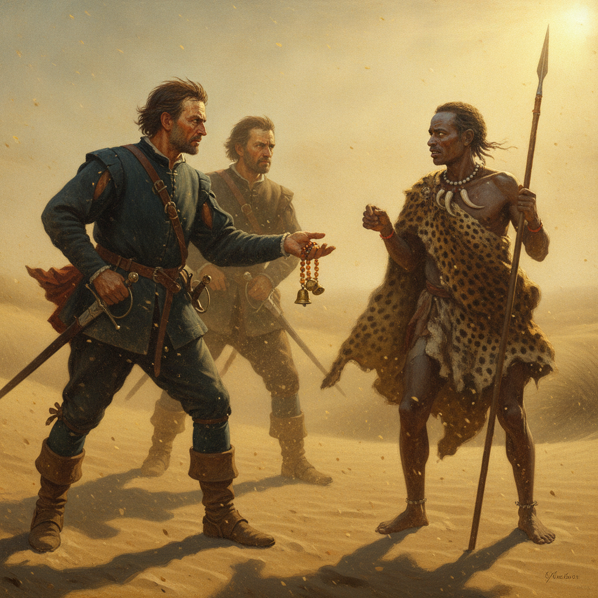
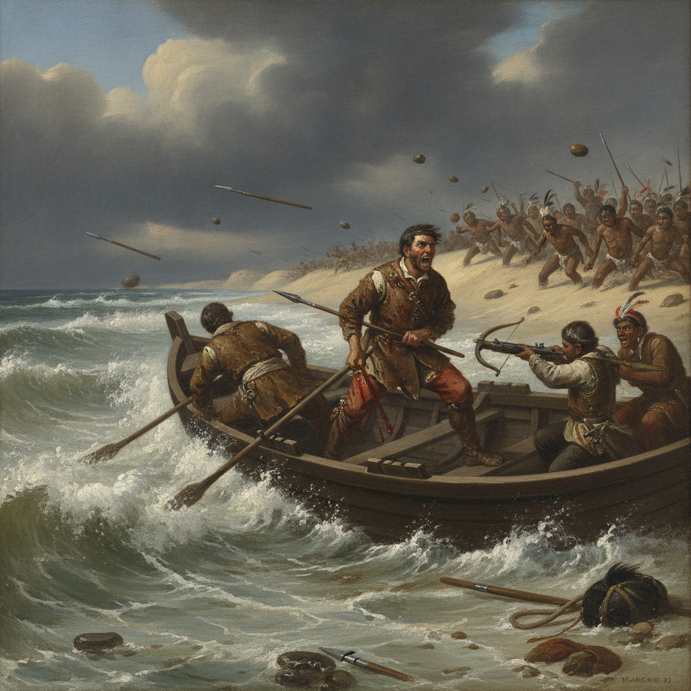
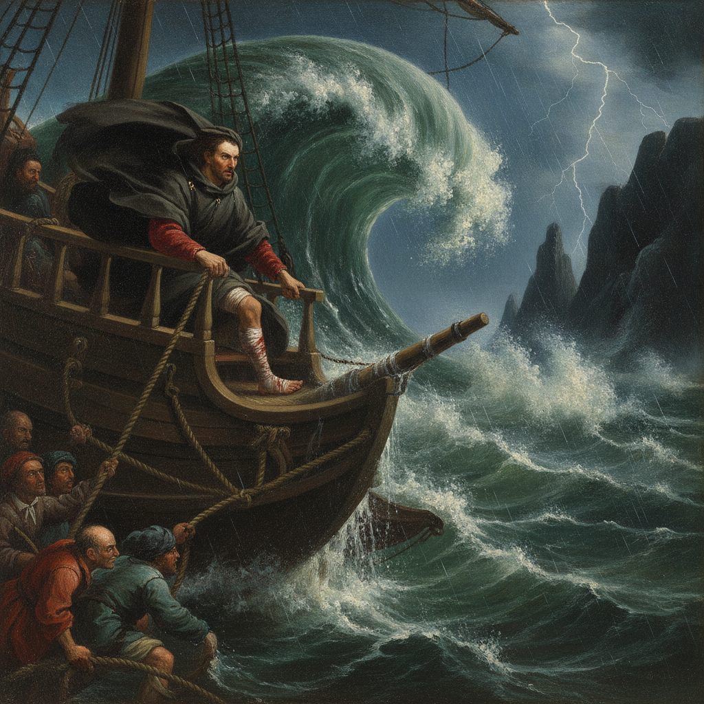
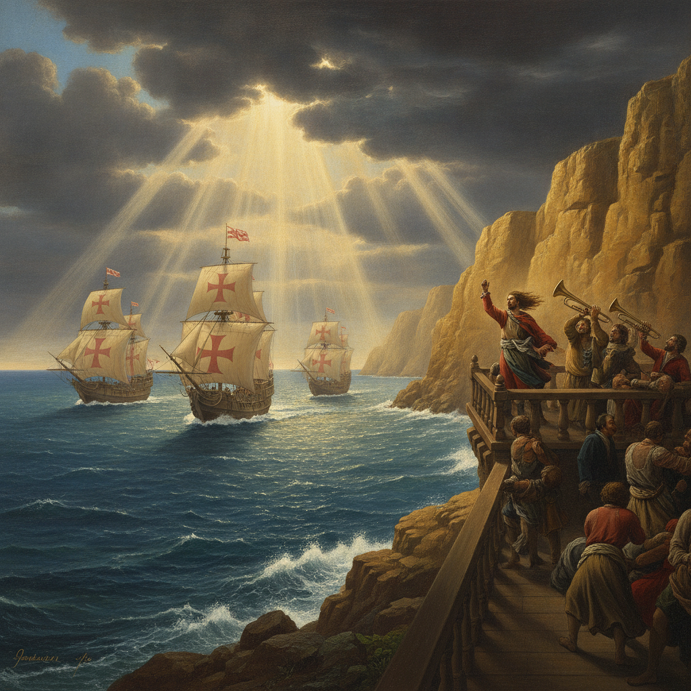
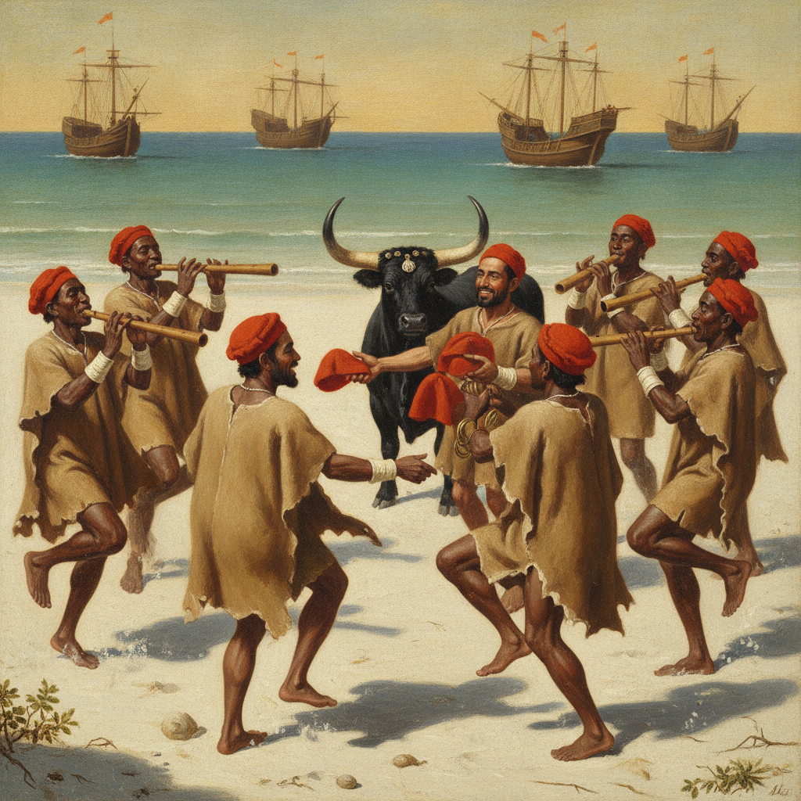
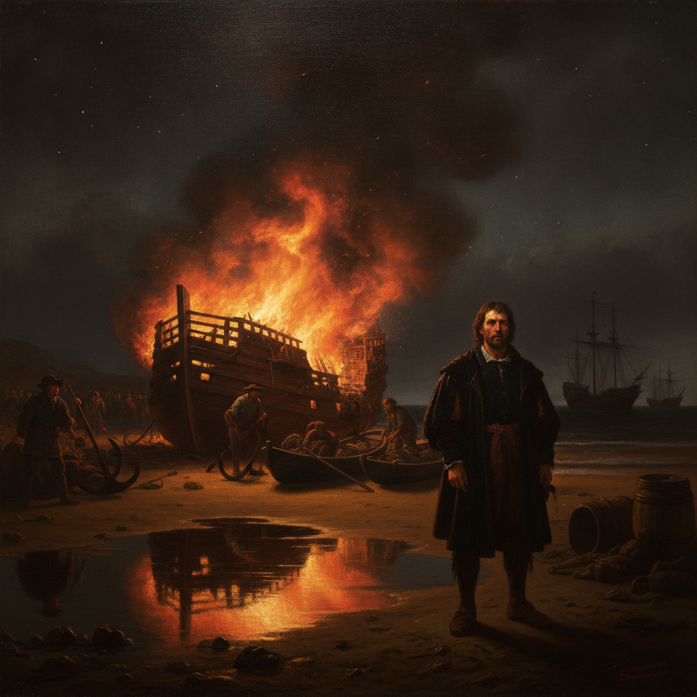
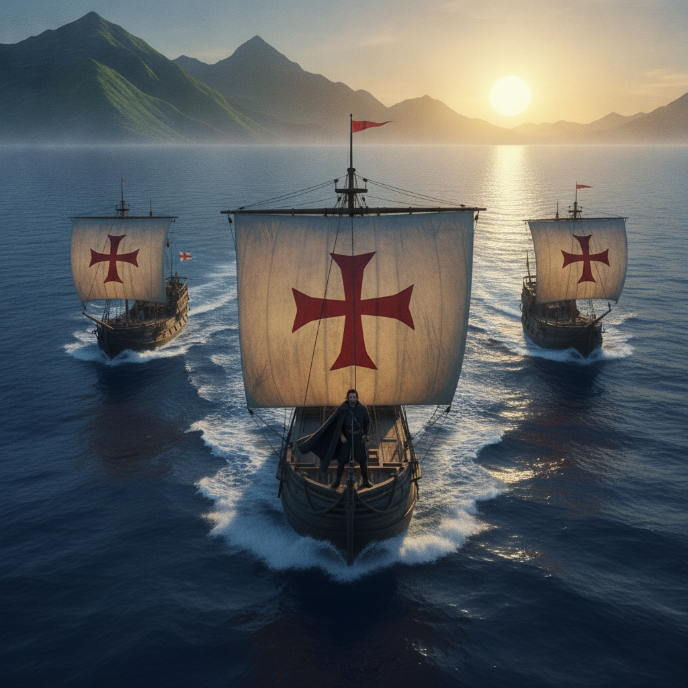

# Storyboard — Chapter 1 Episode 3: Cape of Good Hope

**Lock Manifest:** [`production/locks/CH01-EP03-lock-v1.md`](../production/locks/CH01-EP03-lock-v1.md)  
**Visual Style:** `MASTER_STYLE_02` (High-Drama European Historical Oil Painting)  
**Date:** 2026-08-26

---

## CH01-EP03-S01 — Careening and Wood Gathering at St Helena Bay

* **Date:** 4–7 November 1497
* **Image:** 
* **Description:** High-drama visceral scene: massive carrack heeled on sand spit, black pitch smoke, frantic barnacle scraping, Vasco roaring orders to armed sentries.
* **SHA-256:** `b33432b889bb7c72c6126ee1fd0cb2634ffb7087a84bfe2cb538ccb2825d9aa0`

---

## CH01-EP03-S02 — First Encounter on the Strand

* **Date:** 7–8 November 1497
* **Image:** 
* **Description:** Breath-holding psychological standoff on windblown dunes: sand stinging faces, glinting brass hawk-bells, fingers hovering near daggers and fire-hardened spears.
* **SHA-256:** `31e07869fa5b4d19d59d33d1541258232e8ea2530ecac68e80a4401b81d3d65a`

---

## CH01-EP03-S03 — Skirmish on the Beach

* **Date:** 10–12 November 1497
* **Image:** 
* **Description:** Explosive surf battle: blood in foam, wooden spears raining down, Vasco wounded in thigh gripping the gunwale in fury, crossbow firing through spray.
* **SHA-256:** `8dec72e91b85cde977376d6ae4f8375e79584060cc1be961704b2776154a1c14`

---

## CH01-EP03-S04 — Battling the Cape Headwinds

* **Date:** 18–20 November 1497
* **Image:** 
* **Description:** Cataclysmic tempest at the Cape of Storms: 45-degree roll, colossal black wave towering over deck, lightning illuminating black Cape cliffs, Vasco defying the gale.
* **SHA-256:** `69dac404c535948fce1a0d1fdc3139af166d086606e319888527839325bbc0a3`

---

## CH01-EP03-S05 — Rounding the Cape of Good Hope

* **Date:** 22 November 1497
* **Image:** 
* **Description:** Glorious emotional triumph: golden god-rays bursting through black storm clouds, red Order of Christ crosses glowing, trumpets blaring, weeping sailors embracing.
* **SHA-256:** `a614cdf7833c5bdbd6ad5ce76f4c9964ae04469eacb703f5e4ed3b4677920fc5`

---

## CH01-EP03-S06 — Music and Trade at Mossel Bay

* **Date:** 25–27 November 1497
* **Image:** 
* **Description:** Exuberant, swirling celebration on sand: hypnotic multi-part reed flutes, dust kicking up under stomping feet, scarlet caps bartered for a magnificent black ox.
* **SHA-256:** `43d5fb0517c000cd4c92545f947d348fc23fda50481de141190aa5c347370594`

---

## CH01-EP03-S07 — Breaking Up the Supply Ship

* **Date:** 1–4 December 1497
* **Image:** 
* **Description:** Haunting midnight sacrificial inferno: roaring orange flames engulfing charred oak ribs, swirling embers in starry sky, Vasco watching in somber resolve.
* **SHA-256:** `df370369d42665c54de40820afce1ec9cba3a9e2363ce3f10f18209a3e22dc8e`

---

## CH01-EP03-S08 — Departure into the Unknown East

* **Date:** 8 December 1497
* **Image:** 
* **Description:** Monumental cinematic finale: three battle-scarred carracks slicing through radiant sunrise on deep blue Indian Ocean, African mountains receding into purple mist.
* **SHA-256:** `8cdb44b53c0c34b06cdbec000cd759c54cb76d591f1b4389e04188e66c2c3335`

---

