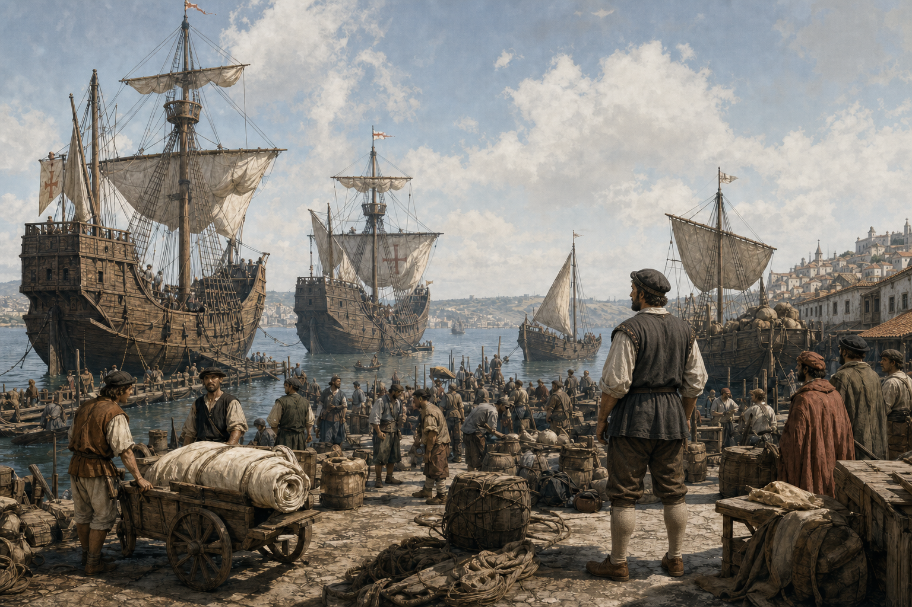
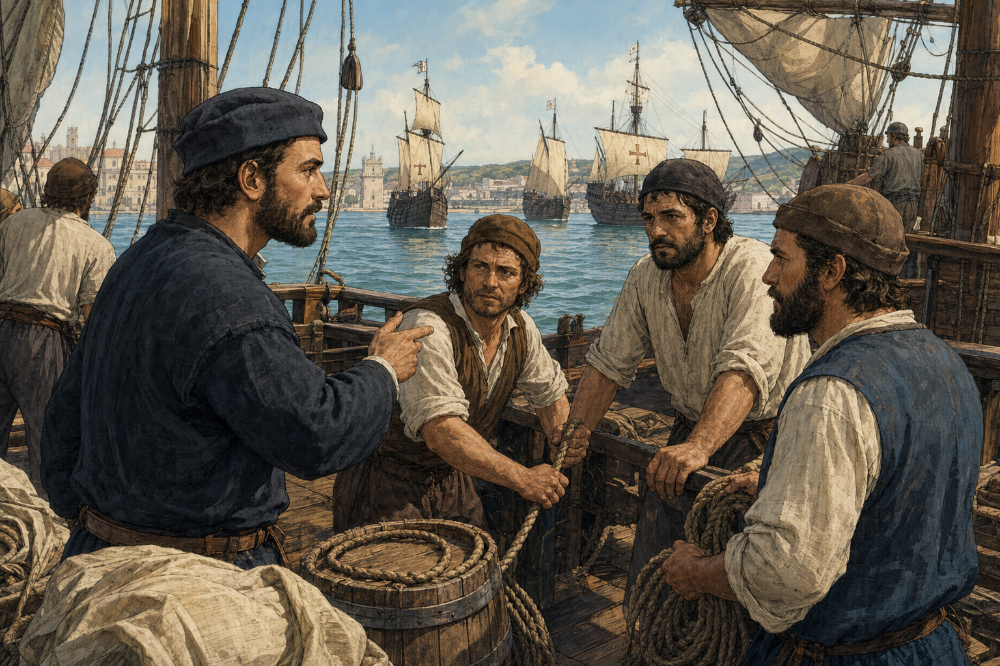
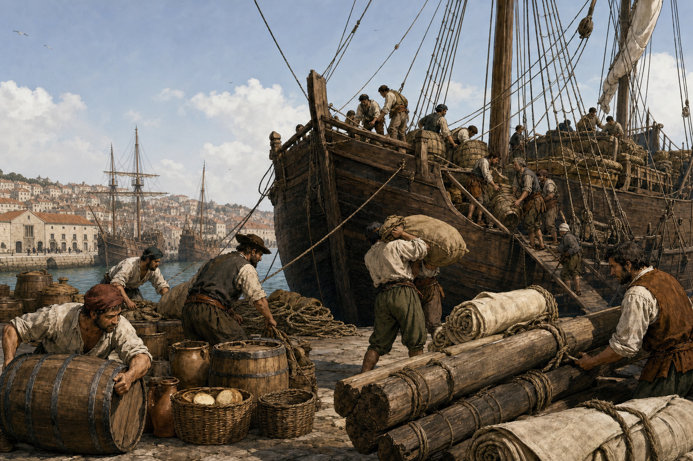
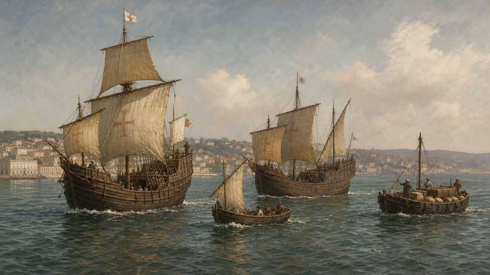
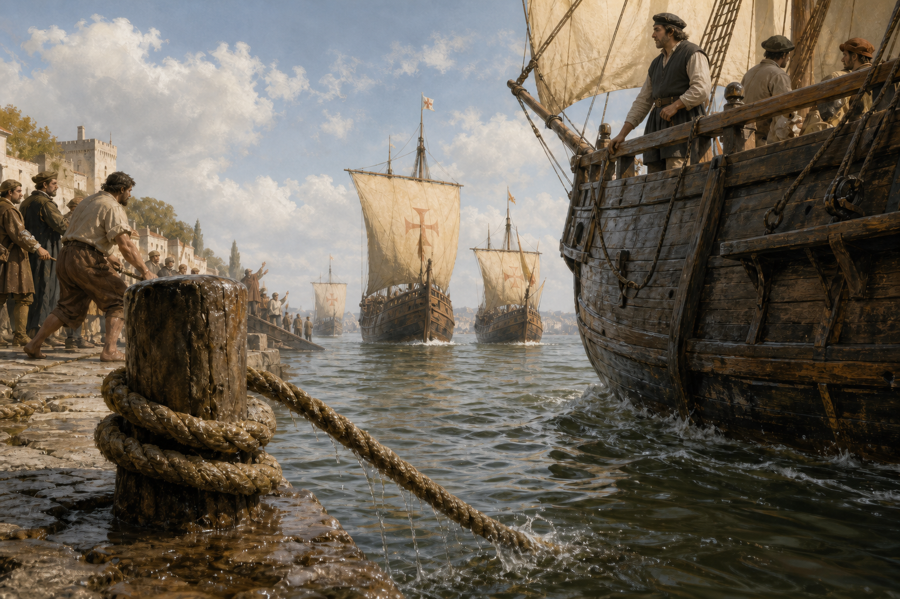
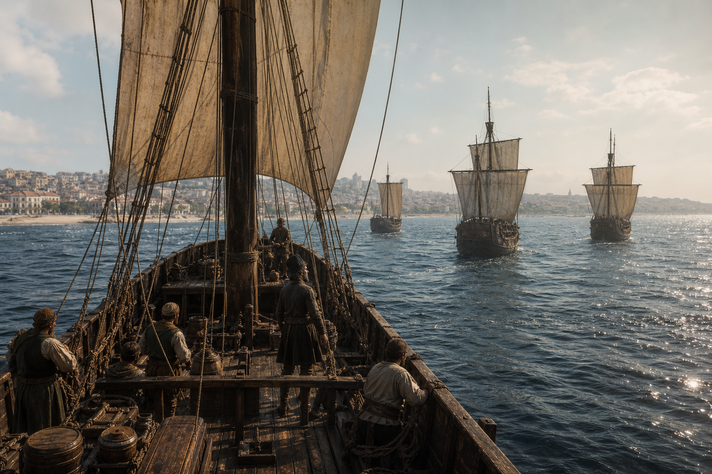
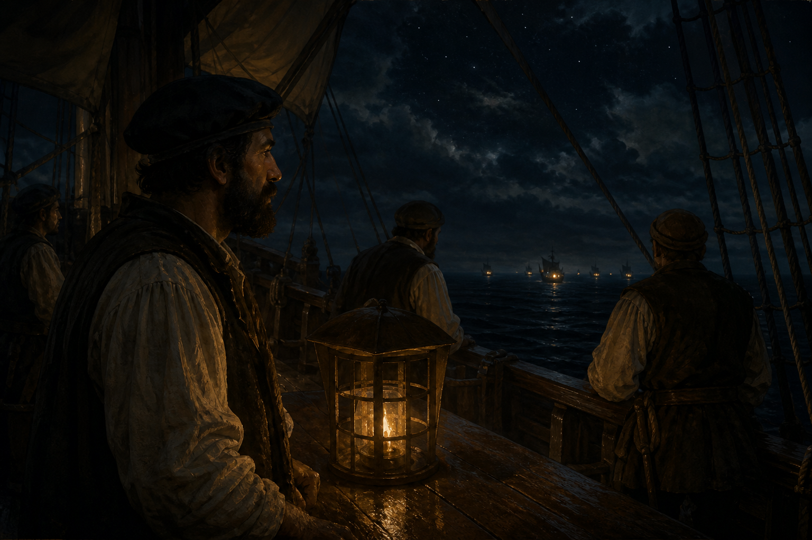
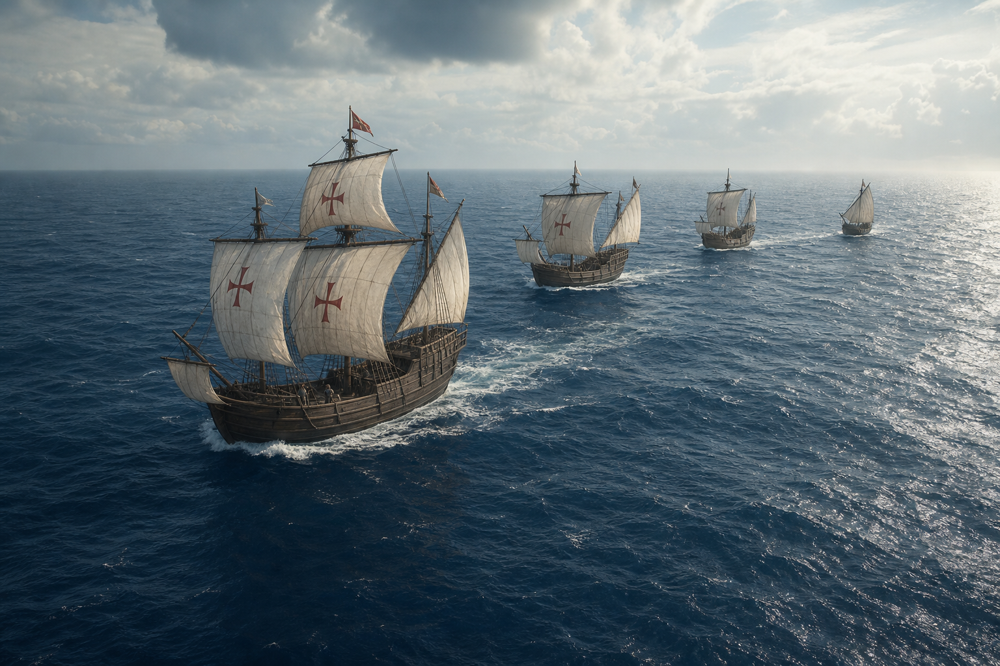

# CH01 — Lisbon: The Departure

## Approved storyboard assembly

**Status:** LOCKED / CANONICAL — CH01-LOCK-v1 — 24 August 2026  
**Source spine:** Anonymous first-voyage *Roteiro*, Ravenstein 1898 edition  
**Visual benchmark:** MASTER_STYLE_01, established by CH01-S01-v1  
**Image policy:** Every panel below is an approved canonical raster; source fact, reconstruction, and cinematic interpretation remain distinguished in the scene files.

### Panel 01 — The Armada Is Assembled

**Scene:** [CH01-S01](../scenes/CH01-S01.md)  
**Beat:** Establish Belém as a dense working Tagus waterfront and introduce the four-vessel expedition.  
**Transition:** Fade in from a dark page into summer haze; hold on the fleet and foreground labor.

### Panel 02 — Command Before the River

**Scene:** [CH01-S02](../scenes/CH01-S02.md)  
**Beat:** Vasco checks readiness with the senior officers through practical gestures and equipment.  
**Transition:** Cut from the wide fleet to deck-height human detail; retain the Tagus in the background.

### Panel 03 — Cargo and Water

**Scene:** [CH01-S03](../scenes/CH01-S03.md)  
**Beat:** Water, food, rope, sailcloth, and timber make the voyage’s logistical burden visible.  
**Transition:** Match cut from a coil of rope in S02 to the cargo labor and supply ship in S03.

### Panel 04 — The Four Silhouettes

**Scene:** [CH01-S04](../scenes/CH01-S04.md)  
**Beat:** The four ships read as distinct working vessels in the Tagus, not identical fantasy ships or a modern naval formation.  
**Transition:** Pull out from dock labor to a wide river composition; let the water carry the eye across the fleet.

### Panel 05 — Casting Off

**Scene:** [CH01-S05](../scenes/CH01-S05.md)  
**Beat:** A wet mooring rope drops and the expedition begins to move.  
**Transition:** Use the rope as a visual wipe from quay to open water; emphasize sound design potential in animation.

### Panel 06 — Belém Falls Behind

**Scene:** [CH01-S06](../scenes/CH01-S06.md)  
**Beat:** Lisbon recedes while the fleet enters the Atlantic; the emotional register is uncertainty, not conquest.  
**Transition:** Stern wake leads into atmospheric perspective; reduce the shoreline’s scale without erasing the settled landscape.

### Panel 07 — First Watch

**Scene:** [CH01-S07](../scenes/CH01-S07.md)  
**Beat:** The first night watch turns departure into continuous maritime labor.  
**Transition:** Dissolve from the last daylight on the wake into lantern light, wet timber, and distant fleet lamps.

### Panel 08 — Southward Course

**Scene:** [CH01-S08](../scenes/CH01-S08.md)  
**Beat:** The four vessels take the deliberate southbound Atlantic course.  
**Transition:** End on a high wide hold over open water; use the fleet’s spacing as the chapter’s final graphic shape.

## Suggested page rhythm

- **Page 1:** Panels 01–02 — place and command.
- **Page 2:** Panels 03–04 — logistics and fleet identity.
- **Page 3:** Panels 05–06 — departure and receding Lisbon.
- **Page 4:** Panels 07–08 — first night and the southbound course.

## Caption discipline

Narration may summarize the documented departure on 8 July 1497 and the southward Atlantic course. Do not add invented dialogue as historical quotation. Any reconstructed or cinematic caption must be labeled in the script.
